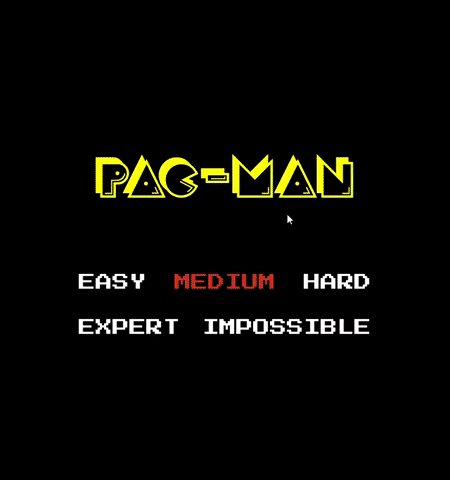
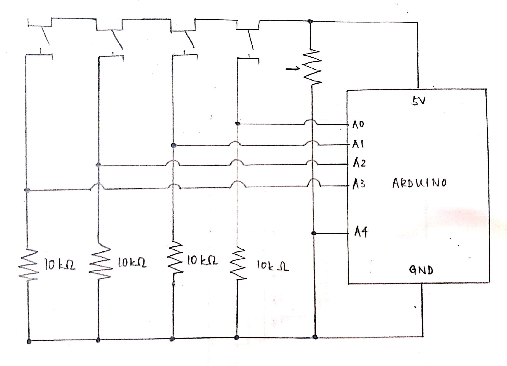
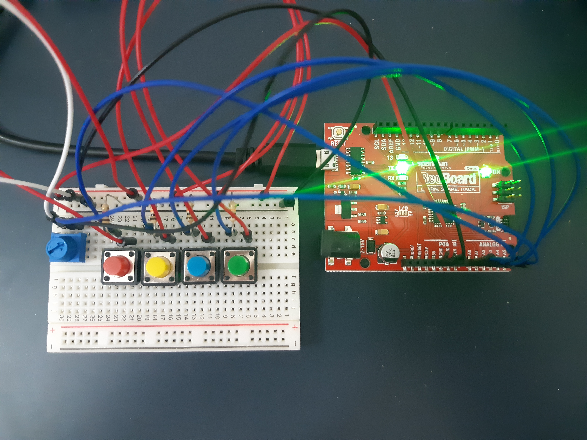

# Pac-Man
My version of Pac-Man, playable using inputs from Arduino or simply with the arrow keys on your computer! Play it in your browser [here](https://editor.p5js.org/vnling/full/dgGPDL9Zs).

### Instructions

Play offline in Processing and/or Arduino:

  
For Processing with Arduino

   
  My Arduino circuit consists of four momentary switches with a potentiometer. The switches provide directional input for the Pac-Man sprite, while the potentiometer can be used to select the level of difficulty in the start screen. The PacMan_Processing and PacMan_Arduino folders contain all files and code needed for this configuration.
  
    
  

  
For Processing only

   
  The PacMan_ComputerOnly folder contains all files and code needed for this configuration.
  

### Built With

- **Offline Version**
  - Processing (Java)
  - Arduino (C++)
  
- **Web Version**
  - p5.js (Javascript)

### Credits 

I drew inspiration from [Jay McDaniel's Pacman](https://github.com/JayMcDaniel/pacman/tree/master/localhost/pacman) written in p5.js.
